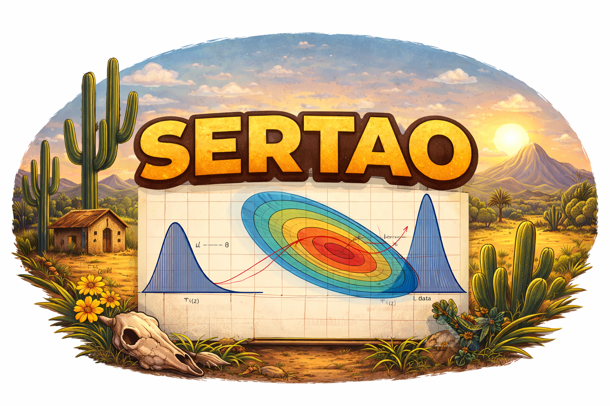

# SERTAO
**System for Estimation of Cosmological paRameTers and Analysis of Observables**

<p align="center">
  
</p>

SERTAO is a Python framework for Bayesian estimation of cosmological parameters from observational data. It uses nested sampling and is designed to be simple: the user defines a cosmological model and SERTAO handles everything else — likelihood evaluation, sampling, checkpointing, and output.

---

## Quick Start

```bash
# Install
pip install -e .

# Run a standard ΛCDM analysis
python run.py --model LCDM

# Run with MPI (4 independent chains)
mpirun -np 4 python run.py --model LCDM

# Verify that all likelihoods are working
python test_likelihoods.py
```

---

## Requirements

- Python ≥ 3.9
- numpy, scipy, matplotlib, pandas, dynesty, mpi4py

```bash
pip install numpy scipy matplotlib pandas dynesty mpi4py
```

---

## Available Models

Ready-to-use models are in `theory_models/`. To run any of them:

```bash
python run.py --model LCDM               # flat ΛCDM
python run.py --model LCDM_neutrinos     # ΛCDM + massive neutrinos + optional Neff
python run.py --model wCDM               # constant dark energy equation of state
python run.py --model w0waCDM            # CPL parametrisation (w0, wa)
```

### Adding a new model

Create `theory_models/my_model.py` with three elements:

```python
import numpy as np

DATASETS      = ['Pantheon+', 'BAO_DESI', 'BBN']
ANALYSIS_NAME = "my_model"

PRIORS = {
    'H0':        (40.0, 90.0),
    'Omega_cdm': (0.10, 0.50),
    'Omega_b':   (0.02, 0.06),
    'M_B':       (-21.0, -18.0),   # nuisance for Pantheon+
}

def H_model(z, p):
    H0      = p['H0']
    Omega_m = p['Omega_cdm'] + p['Omega_b']
    Omega_L = 1.0 - Omega_m
    H2 = Omega_m * (1+z)**3 + Omega_L
    return H0 * np.sqrt(max(H2, 0.0))
```

Then run:

```bash
python run.py --model my_model
```

---

## Implemented Likelihoods

| Name | Description |
|---|---|
| `BAO_DESI` | Baryon Acoustic Oscillations — DESI DR2 (7 bins, 0.3 < z < 2.3) |
| `BAO_2D` | Angular BAO (2D) |
| `Pantheon+` | Type Ia Supernovae — Pantheon+ (1701 SNe) |
| `Pantheon+SHOES` | Pantheon+ calibrated with SH0ES Cepheid anchor |
| `Union3` | Type Ia Supernovae — Union 3.0 (2087 SNe) |
| `BBN` | Primordial nucleosynthesis prior on ωb h² (Planck 2018) |
| `CMB θ*` | Compressed CMB likelihood: R, la, ωb h² |
| `CC` | Cosmic Chronometers H(z) |
| `RSD` | Redshift-Space Distortions f σ8(z) |
| `f` | Linear growth rate f(z) |

> **Note:** `Pantheon+` and `Union3` cannot be used simultaneously.

---

## Project Structure

```
SERTAO/
├── run.py                    # Entry point — runs any model
├── test_likelihoods.py       # Automated test suite (21 tests)
│
├── theory_models/            # Cosmological models (edit here)
│   ├── LCDM.py
│   ├── LCDM_neutrinos.py
│   ├── wCDM.py
│   └── w0waCDM.py
│
├── SERTAO/                   # Core library (do not modify)
│   ├── engine.py
│   ├── cosmology.py
│   ├── neutrinos.py
│   ├── MCMC.py
│   ├── scalar_field.py
│   └── hybrid_cosmology.py
│
├── likelihoods/              # Likelihood functions (do not modify)
├── data/                     # Observational data files
└── chains/                   # Output chains (auto-created)
```

---

## Output

Results are saved in `chains/` in [GetDist](https://github.com/cmbant/getdist) format:

```
chains/LCDM_1.txt          # weight | -logL | parameters
chains/LCDM.paramnames     # parameter names and LaTeX labels
chains/LCDM.ranges         # prior ranges
chains/LCDM_logZ.txt       # Bayesian evidence  log Z ± σ_Z
```

---

## Running Options

```bash
python run.py --model LCDM                        # standard run
python run.py --model LCDM --nlive 500            # more live points (higher accuracy)
python run.py --model LCDM --output my_results/   # custom output directory
python run.py --model LCDM --no-resume            # start fresh (ignore checkpoint)
mpirun -np 4 python run.py --model LCDM           # 4 parallel chains (recommended)
```

Runs are automatically resumed from the last checkpoint if interrupted. The terminal displays a live table updated every 30 seconds:

```
  iter     H0  Omega_cdm  Omega_b  chi2_eff    logZ  DlogZ    calls
------------------------------------------------------------------------
   312   67.41     0.2638   0.0493     23.87  -12.44  0.821    6,240
   512   67.89     0.2612   0.0491     22.14  -12.41  0.621   11,264
```

---

## Testing

Run the full test suite to verify that all likelihoods are working correctly:

```bash
python test_likelihoods.py       # clean output
python test_likelihoods.py -v    # verbose (shows values)
```

Expected output:

```
=================================================================
  SERTAO -- likelihood test suite
=================================================================

  PASS  BBN / fiducial logL
  PASS  BBN / parameter sensitivity
  PASS  BAO_DESI / fiducial logL
  PASS  BAO_DESI / sensitivity
  PASS  CMBTheta / fiducial logL
  PASS  RSD / fiducial logL
  ...
  PASS  Engine / BBN + BAO_DESI

  Results: 21 passed  0 failed  0 skipped  / 21 total
=================================================================
```

---

## HybridCosmology (CLASS interface)

The `HybridCosmology` module connects SERTAO to the [CLASS](https://lesgourg.github.io/class_public/class.html) Boltzmann solver, providing access to the matter power spectrum P(k, z), transfer function T(k, z), and other perturbation-level quantities. It inherits from `GenericCosmology` and is fully compatible with all likelihoods.

---

## 📘 Manual

Full documentation is available in the user manual:

[📄 Download the SERTAO Manual (PDF)](docs/SERTAO_manual.pdf)

---

